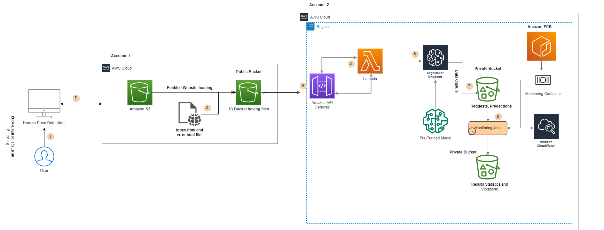
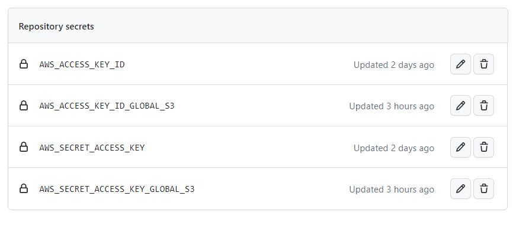
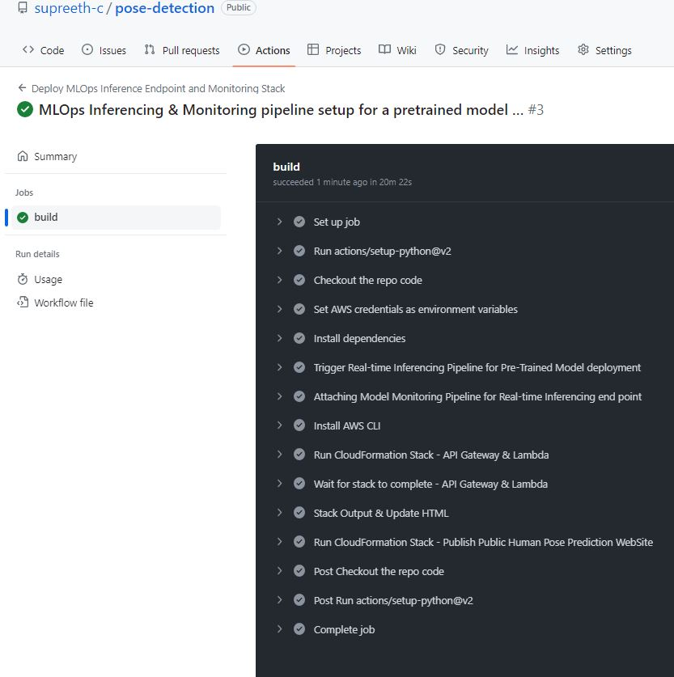
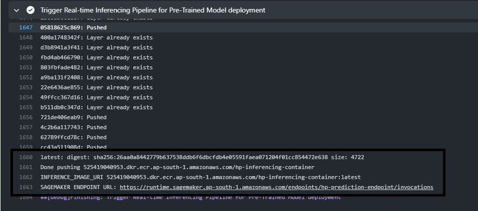
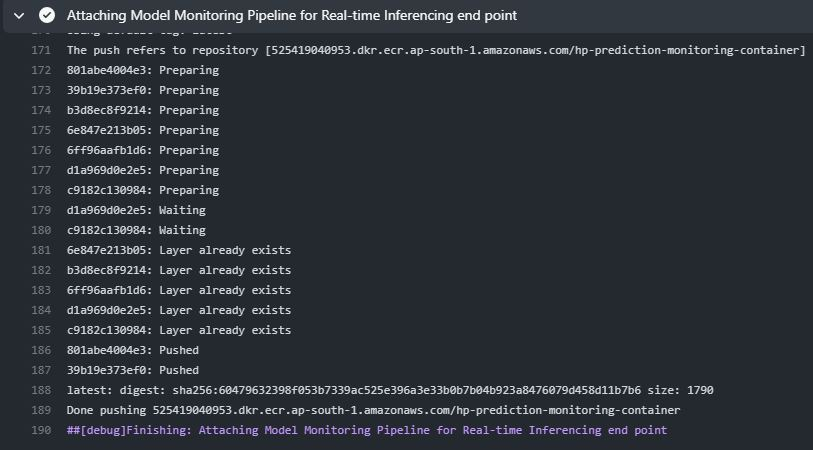
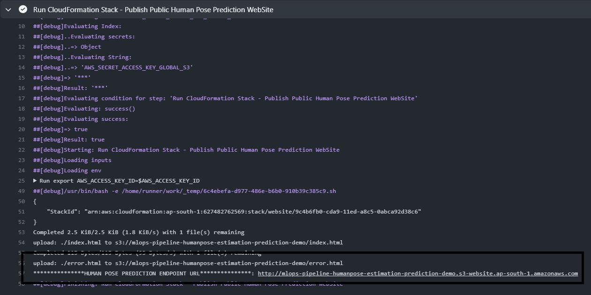

## AWS Infrastructure and Deployment pipeline for an PreTrained ML Model


The repository is to predict human joint location from JPG images that have a pixel size of 256*256. This will be done using the Movnet Singlepose thunder pretrained model, which will be deployed on AWS using CF and SDK to deploy inferencing and monitoring pipeline. The monitoring pipeline will be used to collect and analyze data on average inference time, memory usage, and compute power usage of the deployed model.


## Table of Contents

 [Demo](#demo)

 [Architecture Overview](#architecture-overview)
 
 [Getting Started](#getting-started)

 [Running Tests Locally](#running-tests-locally)


### Demo
Here you will find a short video of the demo 


### Architecture Overview



### Getting started

Here I describe the setup to build and test deployment pipeline on the platforms of Amazon SageMaker, API Gateway, Lambda, S3 Web-Hosting.

For this example of hosting a pre-trained model have used ***Movnet SinglePost-Thunder Tflite Float16*** pretrained model for an input image of 256 pixels only.

*  For the purposes of deploying the stack and endpoints one needs to have an IAM role with trusted relationships for lambda, sagemaker and apigateway, with the following managed permissions
<br>
-- [AmazonSageMakerFullAccess](https://console.aws.amazon.com/iam/home#policies/arn:aws:iam::aws:policy/AmazonSageMakerFullAccess) <br>
-- [AmazonEC2ContainerRegistryFullAccess](https://console.aws.amazon.com/iam/home#policies/arn:aws:iam::aws:policy/AmazonEC2ContainerRegistryFullAccess) <br>
-- [AmazonS3FullAccess](https://console.aws.amazon.com/iam/home#policies/arn:aws:iam::aws:policy/AmazonS3FullAccess) <br>
-- [AmazonAPIGatewayAdministrator](https://console.aws.amazon.com/iam/home#policies/arn:aws:iam::aws:policy/AmazonAPIGatewayAdministrator) <br>
-- [AWSLambda_FullAccess](https://console.aws.amazon.com/iam/home#policies/arn:aws:iam::aws:policy/AWSLambda_FullAccess) <br>
<br>
1. Clone the repository , create a branch and then [update](deployment\config.yml) the config.yml with-in deployment folder with the following parameters:

    ```yaml
    ModelMonitoring:
    monitoringScheduleName: hp-prediction-monitoring-schdule
    threshold: "1.0" 
    monitoringImageName: hp-prediction-monitoring-container
    baseJobName: hp-prediction-monitoring-job
    processingOutput:
        s3DestinationPrefix: endpoint/monitoring_schedule
        outputName: result
        mlDefaultResultSource: /opt/ml/processing/resultdata

    EndpointConfig:
        modelName: hp-prediction-model
        endpointConfigName: hp-prediction-config
        endpointName: hp-prediction-endpoint
        roleArn: arn:aws:iam::XXXXXXXXXXXXXX:role/CloudOps

    Instance:
        instanceType: ml.m5.xlarge
        instanceCount: 1

    InferenceConfig:
        ecrInferenceImageName: hp-inferencing-container

    DataCapture:
        initialSamplingPercentage: 100
        enableCapture: True

    S3Config:
        bucketName: mlops-pipeline-hp-estimation
        inputDir: inputdata/
        s3Prefix: hp/
        realtimeS3Prefix: realtime/
        outputDir: prediction/
        modelDir: model/
        dataCapture: endpoint/data_capture
        tensors: endpoint/tensors

    ``` 
Explanation for few of the keys
<br>
-- **threshold: "1.0"** is set for raising violation as a part of monitoring job when avg inference time exceeds  1 second.
<br>
-- **initialSamplingPercentage: 100**% is set to capture all in flowing request via Inference endpoint
<br>
-- **S3Config**: needs to be updated with only unqiue bucket name and rest of the configurations needs to be kept as is.

2. Update the **deploy-inference.yaml** within .github/workflows folder with the following details within env's in order to ensure the CD pipeline works without any error
    ```shell script
    region: 
    AWS_DEFAULT_REGION:
    ``` 
    **ap-south-1** has been used as by deafult region to test the endpoint, it can be changed to any available region <br>
3. Update the Github Actions secrets with two AWS unqiue account access and secret keys. 
   The below keys are used for deploying the AWS Sagemaker Real Time Endpoints and Monitoring pipeline via SDK-python
    
   ```shell script
       AWS_ACCESS_KEY_ID
       AWS_SECRET_ACCESS_KEY 
   ```
    The second set of key are only used to deploy the Static Webpage hosted in s3 bucket
   ```shell script
       AWS_ACCESS_KEY_ID_GLOBAL_S3
       AWS_SECRET_ACCESS_KEY_GLOBAL_S3
   ```


 4. With these modifications pushed into a branch and later upon raising a Pull Request to main branch only, the CD pipleine will get triggered.<br>
 
<br>
5. Once the CD pipleine has been triggered, you can expect the following details in order<br>
  --**INFERENCE IMAGE URI**
  <br>
  
  -- **SAGEMAKER REALTIME INFERNECE ENDPOINT URL**
  <br>
  
<br>
-- **ATTACHING MONITORING TO ENDPOINT**

<br>
-- **WEB PAGE URL**

<br>
